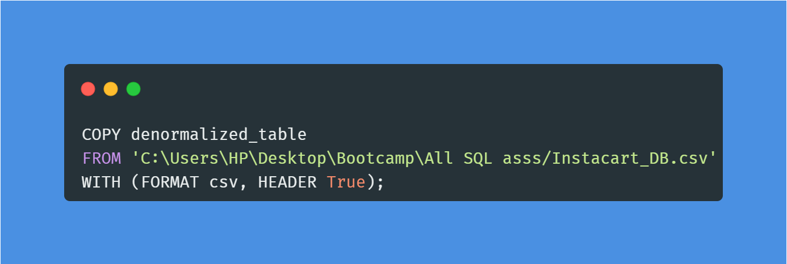
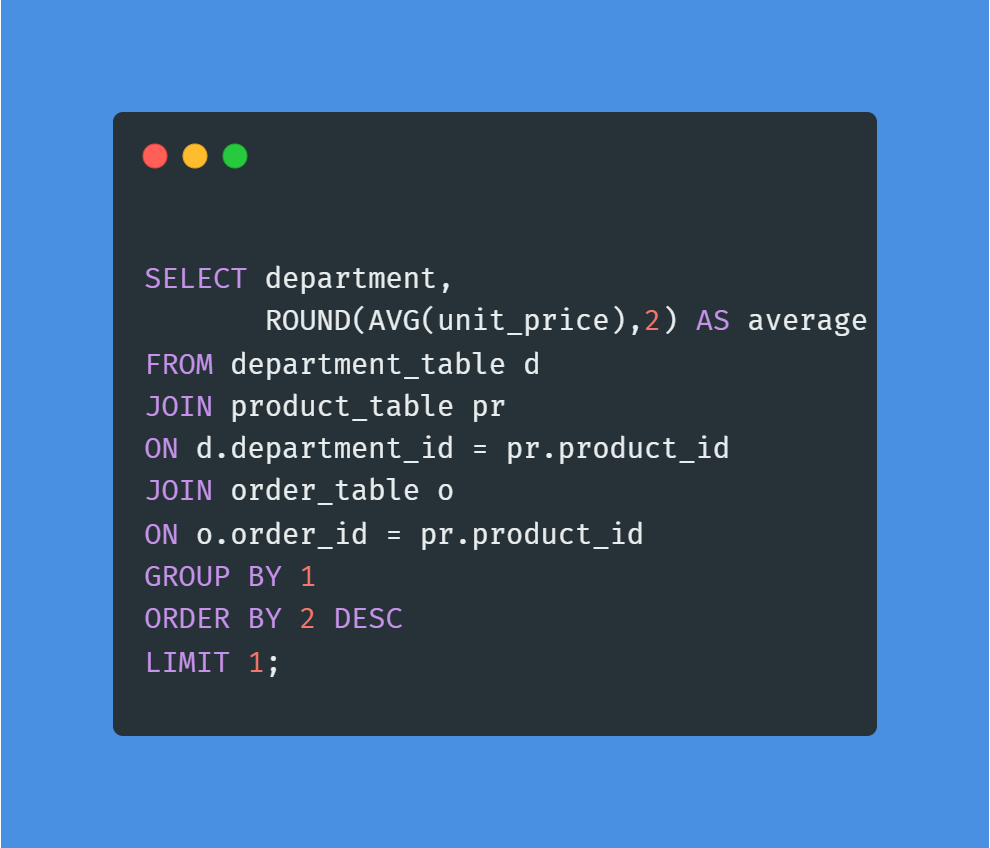

# Instacart_DB

___
### INTRODUCTION
___
An American delivery firm called Instacart offers grocery delivery and pickup services in both the US and Canada. Both a website and a mobile app are used by the business to provide its services. The sales analysis of "instacart store" is the subject of this sql project. The goal of the project is to analyze and generate insights to enable the store make data-driven decisions and respond to stakeholder questions.

### PROBLEM STATEMENT
___
1. On which day(s) of the week are condoms mostly sold?
2. At what time of the day is condom mostly sold?
3. Which aisle/s can I find all Non-Alcholic drinks?
4. What is the top-selling product by revenue, and how much revenue have they generated?
5. which department has the highest average spend per customer?
6. Which product generated more profit?
7. What are the 3 aisles with the most orders, and which departments do these orders belong to
8. Which 3 users generated the highest revenue and how many aisles did they order from?
9. What is the average number of orders placed by days of the week?
10. What is the hour of the day with the highest number of orders?

### SKILL DEMONSTRATED
___
This project put my understanding of database design and normalization to the test; postgresql was used in this project.
Before I proceed I would like to briefly explain Nomalization of a database.

##### NORMALIZATION
___
Nomalization is the process of designing a database effectively such that we can avoid data redundancy i.e data duplication.

##### Different levels of normalization
Genarally, we have different levels of normalization and each level has different rules. Below are the ff levels of normalization:
1. First Normal form
   - Every column/attribute need to have a single value
   - Each row should be unique. Either through a single or multiple column.
2. Second Normal form
   - Must be in 1 Normal form
   - All Non Key attributes must be fully dependent on candidate key.
3. Third Normal form
   - Transitive dependecies: No Non-primary column should depend on another non-primary column.

##### Denormalization process
I created a Table to house my denormalized dataset.The code for creating the table is shown below.

Then I imported the data into the table I created using this code;

In order to store the codes before importing them into their various tables later, I denormalize the data by establishing 4 view tables.
Product view              |         order view
:------------------------:|:------------------------:
     |   

aisle_view                |       department_view
:------------------------:|:------------------------:
       |   

I then established 4 tables so I could insert my data into them and finish the normalization process after generating those views.
Below is the code I wrote to create those tables, I also established my primary key and foreign key in the tables so there can be a relationship between those 4 tables.
Product table                   |         order table
:------------------------------:|:---------------------------:
          |   

aisle table                     |       department table
:------------------------------:|:------------------------------:
           |    

Data was then inserted into the tables from the corresponding views I built after creating the tables; below is the code used to insert the data;

Product insert                   |         order insert
:------------------------------:|:---------------------------:
          |   

aisle insert                    |       department insert
:------------------------------:|:------------------------------:
           |    
___

## DATA MODELLING
___
1. The modelling comprises of 4 different tables.
2. The denormalized table was normalized up to the 3NF.
3. A **Star Schema** is the end product of normalization.

#### DATA MODEL

___

## DATA ANALYSIS
___
I used the database to find solutions to issues that stockholders are curious about.

#### BUSINESS PROBLEMS
___
**1. On which day(s) of the week are condoms mostly sold?**
   ### QUERY
   
   
   ### RESULT
   

   /* INSIGHTS; Based on the data, the days condoms are mostly sold is on monday with a summation of 122 on monday,
			 this maybe as a result of the weekend that just ended & people try to restock after their 
			 working hours for the following weekend. */

**2. At what time of the day is condom mostly sold?**
   ### QUERY
   

   ### RESULT
   
   
   /* INSIGHTS: It was observed that condoms were mostly sold in the 4pm in the evening,
			 this is the time people leave their workplace for their respective homes. */

**3. Which aisle/s can I find all Non-Alcholic drinks?**
   ### QUERY
   
   
   ### RESULT
   

   /*INSIGHTS: The aisle with the names frozen juice, beers coolers, cream, milk, red wines,
			and soft drinks is where non-alcoholic beverages can be found. */

**4. What is the top-selling product by revenue, and how much revenue have they generated?**
   ### QUERY
   

   ### RESULT
   

   /* INSIGHTS: According to the money it generated, the best-selling item was "Apple Cinnamon Cheerios Cereal,"
			 which brought in a total of $1555.00. */

**5. which department has the highest average spend per customer?**
### QUERY

### RESULT

/* INSIGHTS: International has an average spend per customer of $37.00, which is the highest department. */

**6. Which product generated more profit?**
   ### QUERY
   

   ### RESULT
   

   /* INSIGHTS: Nesquik Double Chocolate, which had a total profit of $573.30, brought in more money. */

**7. What are the 3 aisles with the most orders, and which departments do these orders belong to**
   ### QUERY
   

   ### RESULT
   

   /* INSIGHTS: The aisles with the most orders are missing, candy chocolate, & ice cream ice asile */

**8. Which 3 users generated the highest revenue and how many aisles did they order from?**
### QUERY

### RESULT

/* INSGHTS: The customers who bought from the candy chocolate aisles and the hair care
			aisles correspondingly brought in the most money for the business. */

**9. What is the average number of orders placed by days of the week?**
### QUERY

### RESULT

/* INSIGHTS: Due to Sunday being a weekend day and the fact that most individuals try to equip their 
			 homes for the coming week, Sunday has the highest average amount of orders placed by day 
			 of the week (183939.00). */
    
**10. WHAT IS THE HOUR OF THE DAY WITH THE HIGHEST NUMBER OF ORDERS?**
### QUERY

### RESULT

/* INSIGHTS: With "88228" total orders generated by 10 am, this is the busiest moment of the day. */

## RECOMMENDATIONS & CONCLUSION
___
The following are my recommendatons based on my analysis:
- Nesquik Double Chocolate was found to have produced the maximum profit, therefore I urged my stakeholders to purchase more of it while still paying attention to other products. The stakeholders could also try to offer a discount on other products to advertise them as well as boost sales.
  
- The "missing" aisle has the most overall sales, which demonstrates how well-liked it is among consumers. To keep up the sales momentum, it is important to determine why this aisle is marked as "missing" and to guarantee that it is properly classified.

- Sunday is the largest average number of orders placed by day of the week because it is a weekend day and most individuals prefer to prepare their homes for the upcoming week; I advise that a discount promotion be run over the weekdays to boost the company's sales.

- The busiest time of the day is around 10 a.m., so I recommend that all instacart employees be present then to ensure a seamless sale of goods.
